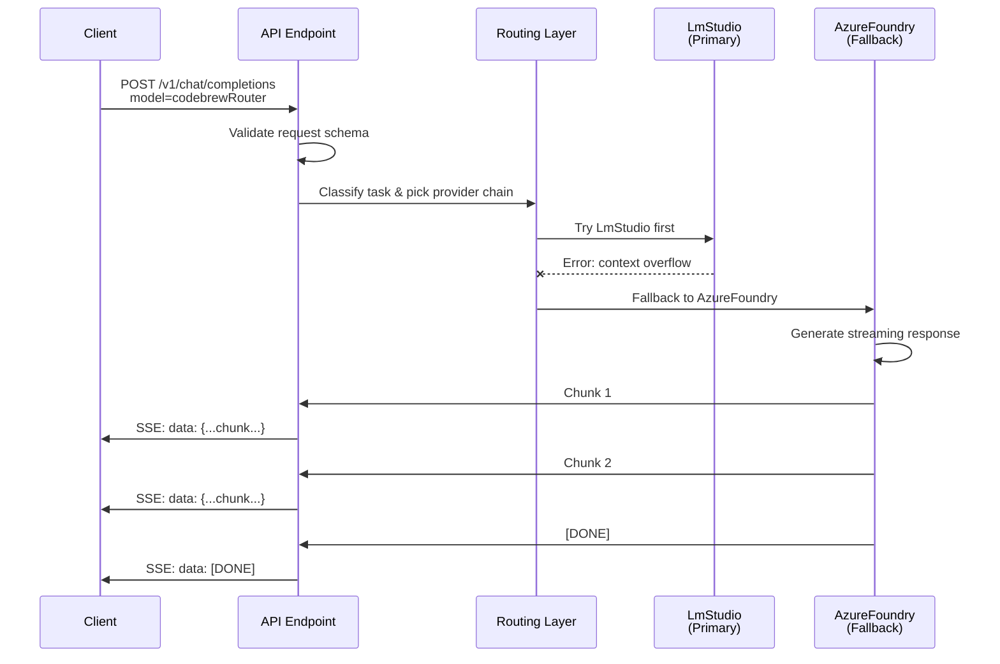
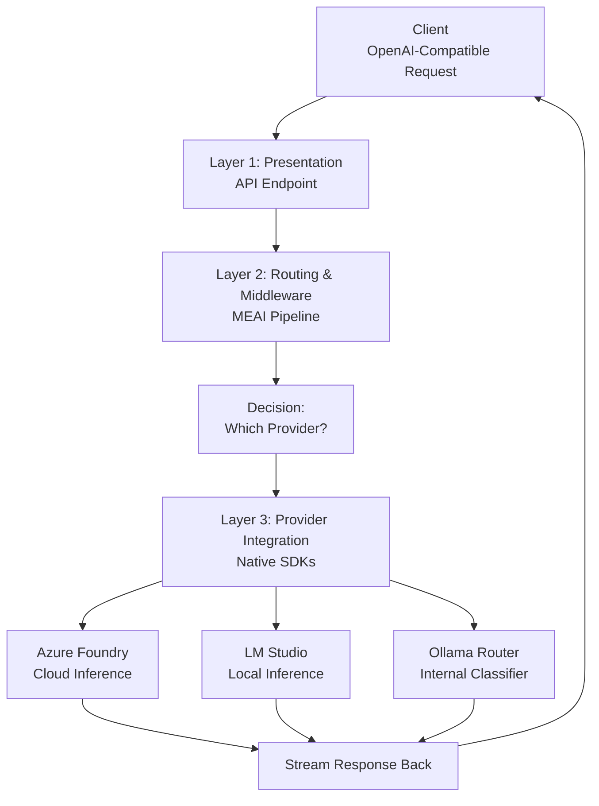
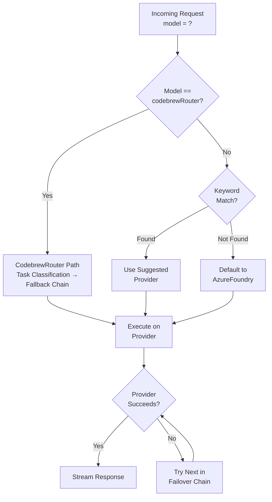
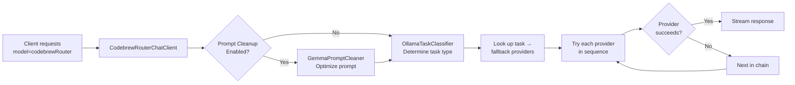

# Blaze.LlmGateway: Comprehensive System Prompt

An intelligent LLM routing proxy built on .NET 10 and Microsoft.Extensions.AI (MEAI). This system prompt provides technical details, architecture flows, system design decisions, and operational guidance for developers, architects, and LLM models contributing to this project.

---

## PART 1: NARRATIVE ONBOARDING

### 1. What Is This System?

**Blaze.LlmGateway** is a strategic LLM routing gateway that solves a fundamental problem: **provider lock-in**. Instead of applications being tightly coupled to a single LLM provider (OpenAI, Azure, etc.), clients send requests to a unified OpenAI-compatible API endpoint. The gateway intelligently classifies each request and routes it to the best available provider—whether that's Azure Foundry for production workloads, a local LM Studio instance for privacy-sensitive tasks, or a specialized provider for specific domains.

**Why it matters:**
- **Provider Agnosticity** — Applications don't care which LLM backend is used; the gateway decides
- **Resilience** — If one provider fails, requests automatically fall back to others
- **Optimization** — Route different task types to different models (reasoning → GPU-heavy, coding → code-optimized)
- **Cost Control** — Balance expensive cloud models with free local alternatives
- **Observability** — All provider interactions flow through a single point with consistent tracing and logging

**Who uses it:**
- Internal agents and LLM-driven applications within your infrastructure
- External clients calling the `/v1/chat/completions` endpoint (OpenAI-compatible contract)
- Microservices that need LLM capabilities without caring about the backend

**High-level mental model:**

```
┌────────────────────────────────────────────────────────┐
│                   Client Application                   │
│         (Internal Agent / External HTTP Client)        │
└────────────────┬─────────────────────────────────────┘
                 │ POST /v1/chat/completions (OpenAI format)
                 ▼
┌────────────────────────────────────────────────────────┐
│            Blaze.LlmGateway (This System)             │
│                                                        │
│  ┌──────────────────────────────────────────────────┐ │
│  │ 1. Validate request, parse model selector        │ │
│  │ 2. Decide which provider to use (router brain)   │ │
│  │ 3. Prep request for that provider                │ │
│  │ 4. Call provider, stream response back           │ │
│  │ 5. If provider fails, try fallback providers     │ │
│  └──────────────────────────────────────────────────┘ │
└─┬──────────────────────────────┬──────────────────┬───┘
  │                              │                  │
  ▼                              ▼                  ▼
Azure Foundry          LM Studio (Local)    OllamaRouter (Classifier)
  (Cloud)              (Private Inference)      (Internal)
```

---

### 2. Watch a Request Flow Through the System

Let's follow a real request step-by-step to understand how everything works together.

**Scenario:** A client sends a code review request.

```
Client → API Endpoint → Routing Decision → Provider Call → Streaming Response → Client
```

**Stage 1: Request Arrives**
```json
{
  "model": "codebrewRouter",  // Virtual task-aware model
  "messages": [
    {"role": "user", "content": "Review this function for bugs."}
  ],
  "temperature": 0.2,
  "stream": true
}
```

**Stage 2: API Validation**
The API validates that `model` is one of the known providers (`codebrewRouter`, `AzureFoundry`, `LmStudio`, etc.) and that required fields are present. Returns an error envelope if validation fails (OpenAI-compatible error format).

**Stage 3: Routing Decision**
Since the user requested `codebrewRouter`, the gateway:
1. **Identifies task type** — "code review" → classifies as `Coding` task
2. **Selects provider chain** — From config, `Coding` tasks prefer `[LmStudio, AzureFoundry]`
3. **Preps request** — Adds any available MCP tools (e.g., file reading) to `ChatOptions.Tools`

**Stage 4: Provider Call (with Failover)**
- **Attempt 1:** Try LmStudio (local inference, lowest latency)
  - If LmStudio is healthy and responds: ✅ Stream response back
  - If LmStudio fails (network error, timeout, context overflow): ❌ Proceed to fallback
- **Attempt 2:** Try AzureFoundry (cloud-based, guaranteed capacity)
  - Success or final failure

**Stage 5: Stream Response**
Each response chunk is wrapped in OpenAI's Server-Sent Events (SSE) format:
```
data: {"object":"chat.completion.chunk","delta":{"content":"The function looks good..."}}
data: [DONE]
```

**Stage 6: Return to Client**
Client receives streaming chunks in real-time, can display them progressively.

**Request Flow Diagram:**



---

### 3. The Three Layers

Blaze.LlmGateway is organized into three conceptual layers:

**Layer 1: Presentation Layer (API)**
- **Role:** Accept OpenAI-compatible requests, validate them, enforce schemas
- **Projects:** `Blaze.LlmGateway.Api`
- **Endpoint:** `POST /v1/chat/completions` (supports streaming and JSON response)
- **Responsibility:** Parse request → validate → pass to routing layer → format response as SSE
- **Doesn't care about:** Which provider is used, how routing works, provider details

**Layer 2: Routing & Middleware Layer (Infrastructure)**
- **Role:** Decide which provider to use, inject tools, handle failover, apply transformations
- **Projects:** `Blaze.LlmGateway.Infrastructure`, `Blaze.LlmGateway.Core`
- **Key Components:**
  - `LlmRoutingChatClient` — Routing decisions
  - `CodebrewRouterChatClient` — Task classification & smart fallback
  - `GemmaPromptCleaner` — Prompt optimization
  - `OllamaTaskClassifier` — Intent detection
  - MCP tool injection middleware
- **Responsibility:** Implement MEAI middleware pipeline, execute routing strategy, manage failover, apply optimizations
- **Doesn't care about:** HTTP details, SSE formatting, incoming request schema

**Layer 3: Provider Integration Layer (SDKs)**
- **Role:** Call actual LLM providers using their native SDKs
- **Providers:**
  - Azure Foundry — `AzureOpenAIClient`
  - LM Studio — `OpenAIClient` (custom endpoint)
  - Ollama Router (internal) — `OllamaApiClient`
  - Azure Foundry Local — `AzureOpenAIClient` (alt endpoint)
- **Responsibility:** Translate MEAI messages to provider format, call provider, stream results
- **Doesn't care about:** Routing logic, API validation, failover orchestration

**Layer Architecture Diagram:**



---

### 4. Meet the Cast: Your Providers

The gateway currently supports **four active destinations** (and internal infrastructure):

| Provider | Type | Best For | Context Window |
|----------|------|---|---|
| **Azure Foundry** | Cloud | Production workloads, guaranteed capacity, latest models | 128K |
| **LM Studio** | Local | Privacy-sensitive work, offline inference, cost control | 32K |
| **Ollama Router** | Local | Internal routing/classification brain (not exposed to clients) | 32K |
| **Azure Foundry Local** | Local | Development on Foundry Local via local infrastructure | 128K |
| **GitHub Models** | Cloud | GitHub-hosted models, integrated with GitHub ecosystem | Variable |

---

### 5. How Routing Actually Works

Routing determines which provider will handle each request. The system provides multiple routing modes:

**Standard Routing: Keyword-Based**
The gateway scans your message for provider hints:
- Message contains "github" → try GitHub Models
- Message contains "foundry local" → try Foundry Local
- Message contains "lm studio" → try LM Studio
- No hints found → **default to AzureFoundry**

**Advanced Routing: CodebrewRouter Virtual Model**
When a client requests `model: "codebrewRouter"`, a specialized routing subsystem takes over:
1. Cleans/optimizes the prompt via `GemmaPromptCleaner` (if enabled)
2. Classifies the task (Coding, Reasoning, Research, Creative, etc.)
3. Looks up the appropriate provider fallback chain for that task
4. Tries each provider in order until one succeeds

See Section B.3 for detailed CodebrewRouter documentation.

**Future Capability: Semantic Meta-Routing**
The gateway architecture supports a meta-routing stage where an Ollama model (`gemma4:e4b`) provides semantic understanding to suggest the best provider:
- "Write Python code" → suggest `LmStudio` (code-optimized)
- "Analyze this quarterly report" → suggest `AzureFoundry` (reasoning-heavy)
- "Summarize my emails" → suggest `LmStudio` (local, fast)

This feature is available in the codebase and can be integrated when infrastructure requirements are met.

**Routing Decision Tree:**



**Failover Chains Configuration:**
```
AzureFoundry   → [FoundryLocal, LmStudio]
LmStudio       → [FoundryLocal, AzureFoundry]
GithubModels   → [AzureFoundry, FoundryLocal, LmStudio]
FoundryLocal   → [AzureFoundry, LmStudio]
```

If the primary provider fails, the gateway automatically tries the next in the chain. If all providers in the chain fail, the request fails with an error.

---

### 6. Configuration & Secrets: The Setup Story

All provider credentials and settings are injected by **Aspire at runtime**, not stored in configuration files. This keeps secrets out of git and allows different configurations per environment.

**How It Works:**

1. **Developer sets local secrets** (one-time):
   ```powershell
   dotnet user-secrets set "Parameters:azure-foundry-endpoint" "https://..." --project Blaze.LlmGateway.AppHost
   dotnet user-secrets set "Parameters:azure-foundry-api-key" "key..." --project Blaze.LlmGateway.AppHost
   ```

2. **AppHost reads secrets and injects them as env vars**:
   ```
   LlmGateway__Providers__AzureFoundry__Endpoint = "https://..."
   LlmGateway__Providers__AzureFoundry__ApiKey = "key..."
   ```

3. **Configuration binds from env vars**:
   ```csharp
   var options = configuration.GetSection("LlmGateway").Get<LlmGatewayOptions>();
   ```

4. **Runtime uses configured values**:
   The gateway now has provider credentials in memory and can make authenticated calls.

**Credential Shapes (What Each Provider Needs):**

| Provider | Endpoint | Model | API Key | Notes |
|----------|----------|-------|---------|-------|
| AzureFoundry | `https://resource.openai.azure.com/` (full URL with /v1) | `gpt-4o` | Required (or use DefaultAzureCredential) | Production Azure OpenAI |
| LmStudio | `http://192.168.16.56:1234/v1` (with `/v1` path) | `local-model` | Any non-empty value | Local inference server |
| OllamaRouter | `http://192.168.16.53:11434` (primary), `http://192.168.16.12:11434` (fallback) | `gemma4:e4b` | Not needed | Internal classifier |

---

## QUICK REFERENCE: ONE-PAGER

```
╔═════════════════════════════════════════════════════════════════════════════╗
║  BLAZE.LLMGATEWAY: QUICK REFERENCE                                         ║
╠═════════════════════════════════════════════════════════════════════════════╣
║                                                                             ║
║  ACTIVE PROVIDERS                                                           ║
║  ├─ AzureFoundry ........... Cloud, production-grade, 128K context         ║
║  ├─ LmStudio ............... Local, privacy-aware, 32K context             ║
║  └─ OllamaRouter ........... Internal classifier (not for direct routing)   ║
║                                                                             ║
║  ROUTING (Keyword-Only, Meta-Routing Disabled)                             ║
║  ├─ Recognize keywords like "foundry", "studio", "github"                   ║
║  ├─ No hints? → Default to AzureFoundry                                    ║
║  └─ CodebrewRouter? → Task classification + smart fallback chains          ║
║                                                                             ║
║  FAILOVER CHAINS                                                            ║
║  ├─ AzureFoundry ........... → [FoundryLocal, LmStudio]                   ║
║  ├─ LmStudio ............... → [FoundryLocal, AzureFoundry]               ║
║  └─ GithubModels ........... → [AzureFoundry, FoundryLocal, LmStudio]     ║
║                                                                             ║
║  BUILD & RUN                                                                ║
║  ├─ Build: ................. dotnet build -warnaserror                    ║
║  ├─ Test: .................. dotnet test --collect:"XPlat Code Coverage"  ║
║  ├─ Run (Aspire): .......... dotnet run --project Blaze.LlmGateway.AppHost║
║  └─ Run (API only): ........ dotnet run --project Blaze.LlmGateway.Api    ║
║                                                                             ║
║  LOGS                                                                       ║
║  ├─ Log level: ............. Debug (configured in appsettings.json)       ║
║  ├─ Filter: ................ "Blaze.LlmGateway*"                          ║
║  └─ Output: ................ Console (structured JSON in production)      ║
║                                                                             ║
║  KEY FILES                                                                  ║
║  ├─ Routing: ............... LlmGateway.Infrastructure/LlmRoutingChatClient║
║  ├─ Config: ................ Blaze.LlmGateway.Core/Configuration/Options  ║
║  ├─ Providers: ............. Infrastructure/Providers/*                   ║
║  └─ Tests: ................. Blaze.LlmGateway.Tests/*                     ║
║                                                                             ║
║  TROUBLESHOOTING                                                            ║
║  ├─ Provider fails? ........ Check failover logs; next in chain attempted ║
║  ├─ All fail? .............. Check credentials in Aspire parameters       ║
║  ├─ Requests slow? ......... Likely context size issue; enable compaction ║
║  └─ Don't see logs? ........ Set Blaze.LlmGateway log level to Debug      ║
║                                                                             ║
╚═════════════════════════════════════════════════════════════════════════════╝
```

---

## PART 2: DETAILED REFERENCE

### A. Provider Catalog

This section details each provider's capabilities, configuration, and integration specifics.

#### A.1: Provider Overview

| Provider | Status | Keyed DI | Failover Chain | Notes |
|----------|--------|---|---|---|
| **AzureFoundry** | ✅ Active | Yes | Yes | Production-grade cloud model |
| **LmStudio** | ✅ Active | Yes | Yes | Local OpenAI-compatible server |
| **OllamaRouter** | ✅ Active | Yes | No | Internal classifier brain; not routable to clients |
| **FoundryLocal** | ✅ Available | Configurable | Yes | Local Foundry deployment |
| **GithubModels** | ✅ Available | Configurable | Yes | GitHub-hosted models |
| **OllamaLocal** | ✅ Available | Configurable | No | Alternative local inference |

All providers are available in the codebase. Configuration and infrastructure setup determines which ones are active in a given deployment.

---

#### A.2: Azure Foundry

**What it is:** Microsoft's managed cloud LLM service (GPT-4, GPT-4o, etc.).

**Best for:**
- Production workloads requiring guaranteed capacity
- Tasks needing the latest models (GPT-4o with advanced reasoning)
- Scenarios where you need Microsoft support & SLAs

**Configuration:**
```json
{
  "AzureFoundry": {
    "Endpoint": "https://your-resource.openai.azure.com/",
    "ResponsesEndpoint": "https://codebrew-resource.services.ai.azure.com/api/projects/codebrew/openai/v1/responses",
    "Model": "gpt-4o",
    "ApiKey": "your-key-here",
    "MaxContextTokens": 128000,
    "ReservedOutputTokens": 4096
  }
}
```

**Credentials:**
- **Endpoint:** Full Azure OpenAI resource URL (e.g., `https://resource.openai.azure.com/`)
- **ResponsesEndpoint:** Optional; if set, streaming responses are POSTed here for archival/analysis
- **ApiKey:** Azure API key (or omitted to use DefaultAzureCredential with managed identity)
- **Model:** Deployment name on your Azure resource (e.g., `gpt-4o`, `gpt-5.4`)

**Capabilities:**
- Vision support: ✅ Yes (multimodal messages)
- Function calling: ✅ Yes (OpenAI format)
- Streaming: ✅ Yes (SSE)
- Context window: 128,000 tokens
- Cost model: Pay-per-token (Azure pricing)

**Failover behavior:**
- Primary failover chain: `[FoundryLocal, LmStudio]`
- If AzureFoundry times out, the gateway tries FoundryLocal next

**Known quirks:**
- Requires valid Azure subscription & quota
- Deployment names must match model names in config
- Rate limiting may apply at account level

---

#### A.3: LM Studio

**What it is:** Local OpenAI-compatible inference server. You download models (Llama, Mistral, etc.) and run them on your own hardware.

**Best for:**
- Privacy-sensitive workloads (data stays local)
- Development & testing without API costs
- Offline-capable applications
- Fast iteration (no cloud latency)

**Configuration:**
```json
{
  "LmStudio": {
    "Endpoint": "http://192.168.16.56:1234/v1",
    "Model": "local-model",
    "ApiKey": "notneeded",
    "MaxContextTokens": 32768,
    "ReservedOutputTokens": 2048
  }
}
```

**Credentials:**
- **Endpoint:** Full `/v1` path to LM Studio's OpenAI-compatible server (e.g., `http://192.168.16.56:1234/v1`)
  - ⚠️ **Important:** Include `/v1` in the path; don't pass just the base URL
- **ApiKey:** Any non-empty value (LM Studio doesn't validate)
- **Model:** Name of the model loaded in LM Studio (must match exactly)

**Capabilities:**
- Vision support: ⚠️ Depends on model (most common models don't support vision)
- Function calling: ⚠️ Depends on model (limited support)
- Streaming: ✅ Yes (via OpenAI-compatible API)
- Context window: Typically 32K (depends on model; Mistral 7B is common)
- Cost model: Free (runs on your hardware)

**Failover behavior:**
- Primary failover chain: `[FoundryLocal, AzureFoundry]`
- If LM Studio is unreachable, gateway tries FoundryLocal, then AzureFoundry

**Setup:**
1. Download LM Studio from [lmstudio.ai](https://lmstudio.ai)
2. Download a model (e.g., Mistral 7B, Llama 2 13B)
3. Start the server on port 1234
4. Verify it's reachable: `curl http://192.168.16.56:1234/v1/models`

**Known quirks:**
- Requires significant local RAM/GPU memory (depends on model size)
- First run may be slow (model quantization, cache setup)
- Port conflicts if multiple services use 1234

---

#### A.4: Ollama Router (Internal)

**What it is:** A local Ollama instance running the `gemma4:e4b` model, used internally for task classification and prompt optimization. **Not exposed as a routable provider** to clients.

**Best for:**
- Internal routing decisions
- Semantic prompt classification
- Fast intent detection (Ollama is very fast locally)

**Configuration:**
```json
{
  "OllamaRouter": {
    "PrimaryEndpoint": "http://192.168.16.53:11434",
    "FallbackEndpoint": "http://192.168.16.12:11434",
    "Model": "gemma4:e4b",
    "MaxContextTokens": 32768,
    "ReservedOutputTokens": 2048
  }
}
```

**Credentials:**
- **PrimaryEndpoint:** Ollama server (e.g., `http://192.168.16.53:11434`)
- **FallbackEndpoint:** Backup Ollama server for redundancy
- **Model:** Must be installed on both primary & fallback (typically `gemma4:e4b`)

**Current Usage:**
- ✅ Task classification (CodebrewRouter uses this to determine task type)
- ✅ Prompt cleanup (GemmaPromptCleaner uses this to optimize prompts)
- ❌ Meta-routing (disabled; TODO to re-enable via async health check)

**Why the redundancy?**
The router is critical for advanced features. If it goes down, those features fall back gracefully but with reduced functionality. The dual-endpoint config allows automatic fallover.

---

#### A.5: Azure Foundry Local

**What it is:** Azure Foundry installed locally on your machine (Windows/Linux). Similar to AzureFoundry but runs on `http://127.0.0.1:58484` by default.

**Best for:**
- Local development and testing
- Development environments with local Foundry instances
- Testing advanced models without cloud costs

**Configuration:**
```json
{
  "FoundryLocal": {
    "Enabled": true,
    "Endpoint": "http://127.0.0.1:58484",
    "Model": "phi-4-mini",
    "ApiKey": "notneeded",
    "MaxContextTokens": 128000,
    "ReservedOutputTokens": 4096
  }
}
```

**Setup:**
```powershell
winget install Microsoft.FoundryLocal
```

---

#### A.6: GitHub Models

**What it is:** LLM models hosted on GitHub's infrastructure, integrated with GitHub's ecosystem.

**Best for:**
- GitHub-native workflows
- Leveraging existing GitHub authentication
- Integrated CI/CD pipelines

**Configuration:**
```json
{
  "GithubModels": {
    "Endpoint": "https://models.inference.ai.azure.com",
    "Model": "gpt-4o-mini",
    "ApiKey": "your-github-pat",
    "MaxContextTokens": 128000,
    "ReservedOutputTokens": 4096
  }
}
```

**Credentials:**
- **Endpoint:** `https://models.inference.ai.azure.com`
- **ApiKey:** GitHub Personal Access Token with model inference access
- **Model:** Available model name on GitHub Models

---

#### A.7: Ollama Local

**What it is:** Local Ollama instance for running open-source models on your hardware.

**Best for:**
- Cost-free local inference
- Privacy-sensitive workloads
- Experimentation with different models
- Air-gapped environments

**Configuration:**
```json
{
  "OllamaLocal": {
    "PrimaryEndpoint": "http://localhost:11434",
    "FallbackEndpoint": "http://backup-ollama:11434",
    "Model": "mistral",
    "MaxContextTokens": 32768,
    "ReservedOutputTokens": 2048
  }
}
```

**Setup:**
1. Download Ollama from [ollama.ai](https://ollama.ai)
2. Install a model: `ollama pull mistral`
3. Start Ollama: `ollama serve`
4. Verify: `curl http://localhost:11434/api/tags`

---

### B. MEAI Middleware Pipeline & CodebrewRouter

#### B.1: The Middleware Stack

All LLM interactions in Blaze.LlmGateway flow through a **Microsoft.Extensions.AI (MEAI)** middleware pipeline. The pipeline is structured as nested `DelegatingChatClient` implementations, where each layer wraps the one below.

**Stack Structure (Outermost → Innermost):**

```
┌─────────────────────────────────────────────────────┐
│  McpToolDelegatingClient (if enabled)               │
│  - Injects MCP tools into ChatOptions.Tools         │
│  - Currently: placeholder (MCP not fully wired)      │
└──────┬────────────────────────────────────────────┘
       │
┌──────▼────────────────────────────────────────────┐
│  LlmRoutingChatClient                              │
│  - Resolves target provider via routing strategy   │
│  - Handles failover if provider fails              │
│  - Implements streaming failover (first-chunk      │
│    probe pattern)                                  │
└──────┬────────────────────────────────────────────┘
       │
┌──────▼────────────────────────────────────────────┐
│  [Keyed Provider Client] (one per provider)        │
│  - AzureOpenAIClient (for Azure)                   │
│  - OpenAIClient (for LM Studio, GitHub Models)     │
│  - OllamaApiClient (for OllamaRouter)              │
│  - Wrapped with .UseFunctionInvocation()           │
│    to handle tool calls automatically              │
└──────┬────────────────────────────────────────────┘
       │
┌──────▼────────────────────────────────────────────┐
│  Actual HTTP Call to LLM Provider                  │
│  - Network request sent                            │
│  - Streaming response received                     │
│  - Chunks propagated back up the stack             │
└─────────────────────────────────────────────────────┘
```

**Request Flow Through the Stack:**

When an incoming `ChatMessage[]` arrives at the outermost layer:
1. **McpToolDelegatingClient** (if enabled) appends any available MCP tools to `ChatOptions.Tools`
2. **LlmRoutingChatClient** decides which provider to use (e.g., AzureFoundry)
3. **Keyed Provider Client** (AzureOpenAIClient) formats the request for Azure's API
4. HTTP call is made; response chunks flow back up
5. Each layer can inspect/transform chunks (for tracing, logging, etc.)
6. Final chunks reach the client as SSE

**Key Pattern: DelegatingChatClient**

Every custom middleware must inherit from `DelegatingChatClient`, not implement `IChatClient` directly:

```csharp
public class MyCustomMiddleware(IChatClient inner) : DelegatingChatClient(inner)
{
    public override async IAsyncEnumerable<StreamingChatCompletionUpdate> CompleteStreamingAsync(
        IList<ChatMessage> messages,
        ChatOptions? options = null,
        CancellationToken cancellationToken = default)
    {
        // Add custom logic here (logging, validation, transformation)
        
        // Forward to inner layer
        await foreach (var chunk in Inner.CompleteStreamingAsync(messages, options, cancellationToken))
        {
            yield return chunk;
        }
    }
}
```

**Why DelegatingChatClient?**
It handles all the boilerplate (non-streaming methods, parameter forwarding, etc.). You only override the specific methods you need to customize.

---

#### B.2: Keyed DI & Provider Resolution

Providers are resolved via **Keyed Dependency Injection**. This allows multiple `IChatClient` implementations to coexist without ambiguity.

**How it works:**

```csharp
// During startup (InfrastructureServiceExtensions.cs):
services.AddKeyedScoped<IChatClient>("AzureFoundry", (provider, key) =>
    new AzureOpenAIClient(endpoint, apiKey).AsChatClient());

services.AddKeyedScoped<IChatClient>("LmStudio", (provider, key) =>
    new OpenAIClient(endpoint, apiKey).AsChatClient());

// During request handling (LlmRoutingChatClient):
var targetProvider = "AzureFoundry";
var client = serviceProvider.GetKeyedService<IChatClient>(targetProvider);
var response = await client.CompleteStreamingAsync(messages, options);
```

**Why keyed DI?**
- Supports multiple provider implementations without factory boilerplate
- Type-safe (no string concatenation for keys)
- Works seamlessly with ASP.NET Core DI
- Enables easy testing (mock specific providers)

**Naming Convention:**
Keyed service names **must match** the `RouteDestination` enum values:
- `"AzureFoundry"` (keyed DI key) ↔ `RouteDestination.AzureFoundry` (enum)
- `"LmStudio"` ↔ `RouteDestination.LmStudio`

Keep them synchronized!

---

#### B.3: CodebrewRouter: Task-Aware Virtual Model

`CodebrewRouter` is a **virtual composite provider**—not a real LLM, but a routing facade that implements intelligent task classification and selective provider failover.

**When to use CodebrewRouter:**
- You want the gateway to classify your task and pick the best provider automatically
- Your workload spans multiple domains (coding, analysis, reasoning, creative)
- You want to leverage task-specific provider chains (e.g., coding tasks prefer LM Studio)

**Architecture:**



**Step 1: Prompt Cleanup (Optional)**
If enabled, `GemmaPromptCleaner` sends your prompt to `gemma4:e4b` (Ollama) with a tightening instruction. The goal: reduce token count without losing meaning.

- Input: "Can you please review my function? It's been giving me errors and I'm not sure what's wrong."
- Output: "Review function: errors, debugging needed"
- Benefit: Saves tokens, improves downstream reasoning

**Circuit breaker:** If cleanup fails repeatedly, it's bypassed for 5 minutes.

**Step 2: Task Classification**
`OllamaTaskClassifier` analyzes the (possibly cleaned) prompt and outputs a task type:

| Task Type | Examples | Preferred Provider |
|-----------|----------|---|
| **Coding** | "Debug this", "Write a function", "Review this code" | LmStudio |
| **Reasoning** | "Explain quantum mechanics", "Analyze this argument" | AzureFoundry |
| **Research** | "Summarize this paper", "Find information about..." | AzureFoundry |
| **Creative** | "Write a story", "Generate ideas for a novel" | LmStudio |
| **VisionObjectDetection** | "Analyze this image", "What's in this photo?" | AzureFoundry |
| **DataAnalysis** | "Analyze this CSV", "What trends do you see?" | AzureFoundry |
| **General** | Anything else | AzureFoundry |

**Step 3: Provider Fallback Chain**
Once the task type is known, `CodebrewRouter` looks it up in the config:

```json
{
  "CodebrewRouter": {
    "FallbackRules": {
      "Coding":                ["LmStudio", "AzureFoundry"],
      "Reasoning":             ["AzureFoundry", "LmStudio"],
      "Research":              ["AzureFoundry", "LmStudio"],
      "Creative":              ["LmStudio", "AzureFoundry"],
      "VisionObjectDetection": ["AzureFoundry", "LmStudio"],
      "DataAnalysis":          ["AzureFoundry", "LmStudio"],
      "General":               ["AzureFoundry", "LmStudio"]
    }
  }
}
```

For a "Coding" task, try `LmStudio` first; if it fails, fallback to `AzureFoundry`.

**Step 4: Execution & Failover**
The gateway calls the first provider in the chain. If it succeeds, stream the response. If it fails, try the next provider.

**Context Compaction (Advanced)**
If a provider fails due to context overflow, `CodebrewRouter` can compact your conversation history before retrying:

```json
{
  "ContextCompaction": {
    "Enabled": true,
    "TargetBudgetRatio": 0.85,
    "MinMessagesToCompact": 6,
    "PreserveMostRecentMessages": 4,
    "SummaryMaxOutputTokens": 256,
    "SummaryTemperature": 0.0
  }
}
```

This summarizes older messages, keeping the most recent 4 intact, to fit within 85% of the provider's context budget.

**Configuration Reference:**

```csharp
public class CodebrewRouterOptions
{
    public bool Enabled { get; set; } = true;
    public string ModelId { get; set; } = "codebrewRouter";
    public Dictionary<string, List<string>> FallbackRules { get; set; } = new();
    
    public class ContextCompactionOptions
    {
        public bool Enabled { get; set; } = true;
        public double TargetBudgetRatio { get; set; } = 0.85;  // 85% of max context
        public int MinMessagesToCompact { get; set; } = 6;
        public int PreserveMostRecentMessages { get; set; } = 4;
        public int SummaryMaxOutputTokens { get; set; } = 256;
        public double SummaryTemperature { get; set; } = 0.0;
    }
}
```

---

### C. Routing Strategies & Failover

#### C.1: Current Routing (Keyword-Only)

**Status:** Meta-routing is disabled. The gateway currently uses keyword-only routing.

**How it works:**

```csharp
public class KeywordRoutingStrategy(ILogger<KeywordRoutingStrategy> logger)
    : IRoutingStrategy
{
    public async ValueTask<RouteDestination> SelectDestinationAsync(string userMessage)
    {
        // Check for provider hints in the message
        if (userMessage.Contains("lm studio", StringComparison.OrdinalIgnoreCase))
            return RouteDestination.LmStudio;
        
        if (userMessage.Contains("azure foundry", StringComparison.OrdinalIgnoreCase))
            return RouteDestination.AzureFoundry;
        
        if (userMessage.Contains("github", StringComparison.OrdinalIgnoreCase))
            return RouteDestination.GithubModels;
        
        // No match: default
        logger.LogInformation("No routing hint found; defaulting to AzureFoundry");
        return RouteDestination.AzureFoundry;
    }
}
```

**Decision tree:**
1. Scan message for keywords (case-insensitive)
2. If found → use that provider
3. If not found → default to **AzureFoundry**

**Limitations:**
- Simplistic (doesn't understand intent)
- Requires user to explicitly mention provider names
- No task-aware optimization

**Future:** Once Ollama connectivity is resolved, meta-routing will provide semantic understanding. See Section C.3.

---

#### C.2: Failover Chains & Circuit Breaker

When a provider fails, the gateway automatically tries the next in the failover chain.

**Failover Triggers:**

1. **General Exception** — Network error, auth failure, timeout
2. **ContextOverflowException** — Input context exceeds provider's `MaxContextTokens`
3. **Circuit Breaker Cooldown** — If a service fails repeatedly, it's temporarily disabled

**Chain Execution:**

```csharp
// Configured in appsettings.json:
"FailoverChains": {
  "AzureFoundry": ["FoundryLocal", "LmStudio"],
  "LmStudio": ["FoundryLocal", "AzureFoundry"],
  "GithubModels": ["AzureFoundry", "FoundryLocal", "LmStudio"]
}

// Runtime logic (simplified):
var primaryProvider = "AzureFoundry";
var chain = failoverChains[primaryProvider];  // ["FoundryLocal", "LmStudio"]

foreach (var provider in chain)
{
    try
    {
        var result = await CallProvider(provider, request);
        return result;  // Success!
    }
    catch (Exception ex)
    {
        logger.LogWarning($"{provider} failed: {ex.Message}. Trying next in chain.");
        continue;  // Try next provider
    }
}

// All providers exhausted
throw new AllProvidersFailedException(...);
```

**Streaming Failover (First-Chunk Probe):**

For streaming responses, the gateway uses a **first-chunk probe** pattern:

1. Start streaming from primary provider
2. Wait for the first chunk (with error handling)
3. If first chunk succeeds, continue streaming
4. If first chunk fails, immediately stop and try next provider

This minimizes time wasted on a failing provider and ensures fast failover.

**Circuit Breaker:**

If a provider fails N times in a row, it's temporarily disabled:

```csharp
// Example: Ollama router
if (ollamaFailureCount >= 3)
{
    logger.LogWarning("Ollama router circuit breaker open. Disabling for 5 minutes.");
    ollamaCircuitBreakerCooldown = DateTime.UtcNow.AddMinutes(5);
}
```

During cooldown, that provider is skipped in the failover chain, reducing cascading failures.

---

### D. Advanced Features

#### D.1: Prompt Cleanup (GemmaPromptCleaner)

**Purpose:** Optimize prompts to reduce token count while preserving intent.

**How it works:**
The system uses Ollama's `gemma4:e4b` model to intelligently rewrite prompts into a more concise form, reducing token consumption while maintaining semantic meaning.

**Configuration:**
```json
{
  "PromptCleanup": {
    "Enabled": true,
    "MaxOutputTokens": 256,
    "Temperature": 0.0,
    "MinLengthChars": 80,
    "CooldownMinutes": 5
  }
}
```

**Logic:**
1. Check if prompt length < `MinLengthChars` (80 chars default) → skip cleanup
2. Call OllamaRouter (gemma4:e4b) with a tightening prompt
3. Get back a shortened version
4. If shortened version is empty or longer than original → reject, use original
5. If success → use shortened version in all downstream calls

**Circuit breaker:** If cleanup fails 3 times in a row, bypass it for 5 minutes.

**Example:**
- Input: "Can you please review my function? It's been giving me errors and I'm not sure what's wrong."
- Output: "Review function: errors, debugging needed"
- Benefit: ~60% token reduction, clearer intent

---

#### D.2: Task Classification (OllamaTaskClassifier)

**Purpose:** Determine task type for smart provider selection and optimization.

The system analyzes prompts to classify them into semantic task categories, enabling intelligent provider routing.

**Configuration:**
```json
{
  "TaskClassification": {
    "Enabled": true,
    "MaxOutputTokens": 50,
    "Temperature": 0.0,
    "CooldownMinutes": 5
  }
}
```

**Output:** One of the `TaskType` enum values:
- **Coding** — "Debug this", "Write a function", "Review this code"
- **Reasoning** — "Explain quantum mechanics", "Analyze this argument"
- **Research** — "Summarize this paper", "Find information about..."
- **Creative** — "Write a story", "Generate ideas for a novel"
- **VisionObjectDetection** — "Analyze this image", "What's in this photo?"
- **DataAnalysis** — "Analyze this CSV", "What trends do you see?"
- **General** — Anything else

Used by CodebrewRouter to select provider fallback chain and optimize settings per task type.

---

#### D.3: Context Sizing & Compaction

**Purpose:** Fit large conversations into provider context windows without losing information.

**How it works:**
1. Calculate: `messageTokenCount > provider.MaxContextTokens`?
2. If yes → trigger compaction
3. Summarize older messages (preserving most recent N)
4. Retry with compacted history

**Configuration:**
```json
{
  "ContextSizing": {
    "Enabled": true,
    "TargetBudgetRatio": 0.85,
    "MinMessagesToCompact": 6,
    "PreserveMostRecentMessages": 4,
    "SummaryMaxOutputTokens": 256,
    "SummaryTemperature": 0.0
  }
}
```

**Example:**
- Provider context: 128K tokens
- Budget (85%): 108,800 tokens
- Current messages: 150K tokens (over budget)
- Action: Summarize messages 1-10, keep messages 11-15 intact, retry

**Benefits:**
- Enables long conversations without context overflow
- Preserves recent context for relevance
- Automatic retry with optimized payload

---

### E. Configuration Reference

#### E.1: Full LlmGatewayOptions Structure

```csharp
public class LlmGatewayOptions
{
    public ProvidersOptions Providers { get; set; } = new();
    public RoutingOptions Routing { get; set; } = new();
    public CodebrewRouterOptions CodebrewRouter { get; set; } = new();
    public PromptCleanupOptions PromptCleanup { get; set; } = new();
    public TaskClassificationOptions TaskClassification { get; set; } = new();
    public ContextSizingOptions ContextSizing { get; set; } = new();
}

public class ProvidersOptions
{
    public AzureFoundryOptions AzureFoundry { get; set; } = new();
    public FoundryLocalOptions FoundryLocal { get; set; } = new();
    public OllamaRouterOptions OllamaRouter { get; set; } = new();
    public GithubModelsOptions GithubModels { get; set; } = new();
    public LmStudioOptions LmStudio { get; set; } = new();
}

public class AzureFoundryOptions
{
    public string Endpoint { get; set; } = "";  // Required: https://resource.openai.azure.com/
    public string ResponsesEndpoint { get; set; } = "";  // Optional: for response archival
    public string Model { get; set; } = "gpt-4o";  // Deployment name on Azure
    public string? ApiKey { get; set; }  // Optional: uses DefaultAzureCredential if null
    public int MaxContextTokens { get; set; } = 128000;
    public int ReservedOutputTokens { get; set; } = 4096;
}

public class FoundryLocalOptions
{
    public bool Enabled { get; set; } = false;
    public string Endpoint { get; set; } = "http://127.0.0.1:58484";
    public string Model { get; set; } = "phi-4-mini";
    public string ApiKey { get; set; } = "notneeded";
    public int MaxContextTokens { get; set; } = 128000;
    public int ReservedOutputTokens { get; set; } = 4096;
}

public class OllamaRouterOptions
{
    public string PrimaryEndpoint { get; set; } = "http://192.168.16.53:11434";
    public string FallbackEndpoint { get; set; } = "http://192.168.16.12:11434";
    public string Model { get; set; } = "gemma4:e4b";
    public int MaxContextTokens { get; set; } = 32768;
    public int ReservedOutputTokens { get; set; } = 2048;
}

public class GithubModelsOptions
{
    public string Endpoint { get; set; } = "https://models.inference.ai.azure.com";
    public string Model { get; set; } = "gpt-4o-mini";
    public string? ApiKey { get; set; }  // GitHub PAT with model access
    public int MaxContextTokens { get; set; } = 128000;
    public int ReservedOutputTokens { get; set; } = 4096;
}

public class LmStudioOptions
{
    public string Endpoint { get; set; } = "http://192.168.16.56:1234/v1";  // Include /v1
    public string Model { get; set; } = "local-model";
    public string ApiKey { get; set; } = "notneeded";
    public int MaxContextTokens { get; set; } = 32768;
    public int ReservedOutputTokens { get; set; } = 2048;
}

public class RoutingOptions
{
    public string RouterModel { get; set; } = "router";
    public string FallbackDestination { get; set; } = "AzureFoundry";
    public Dictionary<string, List<string>> FailoverChains { get; set; } = new();
}

public class CodebrewRouterOptions
{
    public bool Enabled { get; set; } = true;
    public string ModelId { get; set; } = "codebrewRouter";
    public Dictionary<string, List<string>> FallbackRules { get; set; } = new();
}

public class PromptCleanupOptions
{
    public bool Enabled { get; set; } = true;
    public int MaxOutputTokens { get; set; } = 256;
    public double Temperature { get; set; } = 0.0;
    public int MinLengthChars { get; set; } = 80;
    public int CooldownMinutes { get; set; } = 5;
}

public class TaskClassificationOptions
{
    public bool Enabled { get; set; } = true;
    public int MaxOutputTokens { get; set; } = 50;
    public double Temperature { get; set; } = 0.0;
    public int CooldownMinutes { get; set; } = 5;
}

public class ContextSizingOptions
{
    public bool Enabled { get; set; } = true;
    public double TargetBudgetRatio { get; set; } = 0.85;
    public int MinMessagesToCompact { get; set; } = 6;
    public int PreserveMostRecentMessages { get; set; } = 4;
    public int SummaryMaxOutputTokens { get; set; } = 256;
    public double SummaryTemperature { get; set; } = 0.0;
}
```

#### E.2: Environment Variable Naming Convention

Configuration binds from JSON structure to environment variables with double-underscore separators:

```
JSON:                                  → ENV:
LlmGateway:Providers:AzureFoundry:     → LlmGateway__Providers__AzureFoundry__
  Endpoint                               Endpoint
```

Example:
```bash
LlmGateway__Providers__AzureFoundry__Endpoint=https://resource.openai.azure.com/
LlmGateway__Providers__AzureFoundry__ApiKey=key...
LlmGateway__Providers__LmStudio__Endpoint=http://192.168.16.56:1234/v1
LlmGateway__Routing__FalloverDestination=AzureFoundry
```

---

### F. Testing & Quality Gates

#### F.1: Build & Run Commands

**Build (with warnings-as-errors):**
```bash
dotnet build Blaze.LlmGateway.slnx --no-incremental -warnaserror
```

**Run tests (with coverage collection):**
```bash
dotnet test Blaze.LlmGateway.Tests\Blaze.LlmGateway.Tests.csproj --no-build --collect:"XPlat Code Coverage"
# Coverage report: ./coverage/index.html
```

**Run a single test class:**
```bash
dotnet test Blaze.LlmGateway.Tests\Blaze.LlmGateway.Tests.csproj --no-build --filter "FullyQualifiedName~LlmRoutingChatClientTests"
```

**Run the API directly (no Aspire):**
```bash
dotnet run --project Blaze.LlmGateway.Api
# Requires manual env var setup; Aspire handles this automatically
```

**Run via Aspire (recommended for local development):**
```bash
dotnet run --project Blaze.LlmGateway.AppHost
# Open http://localhost:8080 for Aspire dashboard
# API available at http://localhost:5022
```

**Run benchmarks:**
```bash
dotnet run --project Blaze.LlmGateway.Benchmarks --configuration Release
```

---

#### F.2: Coverage & Quality Gates

**95% Code Coverage Target:**
The test suite must achieve ≥ 95% code coverage on all public code paths. Coverage is verified in CI.

**Warnings-as-Errors (`-warnaserror`):**
All compiler warnings are treated as errors and must be fixed before merging. This enforces code quality and prevents technical debt.

**Testing Patterns (xUnit + Moq):**

```csharp
[Fact]
public async Task CompleteStreamingAsync_RoutesToCorrectProvider_WhenKeywordMatches()
{
    // Arrange
    var mockProvider = new Mock<IChatClient>();
    mockProvider
        .Setup(p => p.CompleteStreamingAsync(It.IsAny<IList<ChatMessage>>(), It.IsAny<ChatOptions>(), It.IsAny<CancellationToken>()))
        .Returns(GenerateTestChunks());
    
    var router = new LlmRoutingChatClient(mockProvider.Object, strategyMock);
    
    // Act
    var result = router.CompleteStreamingAsync(messages, options, cancellationToken);
    
    // Assert
    mockProvider.Verify(p => p.CompleteStreamingAsync(It.IsAny<IList<ChatMessage>>(), It.IsAny<ChatOptions>(), It.IsAny<CancellationToken>()), Times.Once);
}
```

---

### G. Development Workflow & Contributing

#### G.1: The 9-Agent Development Squad

This repo ships a Claude-powered development squad for rapid, high-quality contributions:

**Two execution paths:**

1. **Phased Conductor (human-gated):**
   ```
   /agent squad "Add feature X"
   ```
   Phases: Planner → Architect → Coder → Tester → Reviewer → Security-Review
   Use when: Task is exploratory, high-risk, or you want human feedback.

2. **Orchestrator (autonomous):**
   ```
   /orchestrate --prd <path>
   ```
   Decompose → Parallel worktrees → Dispatch → Merge → Quality gate
   Use when: PRD is complete, task decomposes into parallel work.

**The 9 Agents:**
- **Conductor** — Orchestrates phases and gates
- **Planner** — Research, specification, planning
- **Architect** — ADR authoring, MEAI validation
- **Coder** — C# implementation
- **Tester** — xUnit tests, 95% coverage
- **Reviewer** — Clean-context diff review
- **Infra** — AppHost, Aspire, secrets
- **Security** — ADR-0008 cloud-egress audits
- **Orchestrator** — Autonomous parallel loop

---

#### G.2: Code Style Conventions

- **Primary constructors:** `public class Service(IDependency dep) { }`
- **Collection expressions:** `int[] arr = [1, 2, 3];`
- **Nullable reference types:** Enabled; use `string?` for nullable
- **CancellationToken:** Propagate throughout async methods
- **Keyed DI:** Use `RouteDestination` enum names as keys
- **MEAI only:** No raw `HttpClient` for LLM calls
- **Middleware:** Always inherit `DelegatingChatClient`, never implement `IChatClient` directly

---

### H. Observability & Debugging

#### H.1: Logging Strategy

**Log levels:**
- **Debug:** Routing decisions, provider selection, failover attempts, configuration load
- **Information:** Request arrivals, successful provider calls, feature toggles
- **Warning:** Provider failures, circuit breaker state changes, degraded mode
- **Error:** Unhandled exceptions, all providers exhausted, auth failures

**Log filter:**
```
"Blaze.LlmGateway*"  // All loggers in the Blaze namespace
```

**Example log lines:**
```
[DEBUG] Routing decision: keyword match "studio" → LmStudio
[INFO] Request 12345 routed to AzureFoundry
[WARN] LmStudio failed: connection timeout. Failover to AzureFoundry.
[ERROR] All providers exhausted for request 12345
```

#### H.2: Troubleshooting Guide

| Problem | Likely Cause | Diagnostic |
|---------|---|---|
| All requests fail with "All providers exhausted" | Provider credentials invalid or endpoints unreachable | Check Aspire parameters; verify endpoints with `curl` |
| Requests are very slow | Large context exceeding budget; compaction triggered | Enable debug logging; check compaction config |
| Only one provider works | Other providers' credentials missing | Set all required env vars in Aspire |
| "Using keyword-only routing" in logs | Ollama router unavailable | Check OllamaRouter endpoints; meta-routing disabled by default |
| CodebrewRouter not working | Task classification disabled or OllamaRouter down | Check TaskClassification config; ensure OllamaRouter is running |

---

### I. Appendix: ADRs & Design Decisions

**Architecture Decision Records (ADRs):**

ADRs are stored in `Docs/adr/` following the [MADR template](https://adr.github.io/madr/):

- **ADR-0001: MEAI Middleware Pipeline** — Why MEAI DelegatingChatClient over custom abstraction
- **ADR-0002: Keyed DI for Provider Selection** — Why keyed DI vs. factory pattern
- **ADR-0003: OpenAI-Compatible API Surface** — Why we expose OpenAI format instead of custom
- **ADR-0008: Cloud-Egress Default-Deny** — Security policy for external calls
- **ADR-0009: Development Squad Orchestration** — Why 9-agent squad for contributions
- **ADR-0010: Parallel Orchestration Path** — Phased vs. autonomous execution

---

## APPENDIX: CONFIGURATION EXAMPLES

### Minimal Configuration (Development)

```json
{
  "LlmGateway": {
    "Providers": {
      "AzureFoundry": {
        "Model": "gpt-4o",
        "MaxContextTokens": 128000
      },
      "LmStudio": {
        "Endpoint": "http://localhost:1234/v1",
        "Model": "mistral-7b"
      },
      "OllamaRouter": {
        "PrimaryEndpoint": "http://localhost:11434",
        "Model": "gemma4:e4b"
      }
    },
    "Routing": {
      "FallbackDestination": "AzureFoundry"
    }
  }
}
```

### Full Configuration (Production)

```json
{
  "LlmGateway": {
    "Providers": {
      "AzureFoundry": {
        "Endpoint": "https://prod.openai.azure.com/",
        "ResponsesEndpoint": "https://archive.example.com/responses",
        "Model": "gpt-4o",
        "MaxContextTokens": 128000,
        "ReservedOutputTokens": 4096
      },
      "LmStudio": {
        "Endpoint": "http://192.168.16.56:1234/v1",
        "Model": "llama2-13b",
        "MaxContextTokens": 32768
      },
      "OllamaRouter": {
        "PrimaryEndpoint": "http://192.168.16.53:11434",
        "FallbackEndpoint": "http://192.168.16.12:11434",
        "Model": "gemma4:e4b"
      }
    },
    "Routing": {
      "RouterModel": "router",
      "FallbackDestination": "AzureFoundry",
      "FailoverChains": {
        "AzureFoundry": ["LmStudio"],
        "LmStudio": ["AzureFoundry"]
      }
    },
    "CodebrewRouter": {
      "Enabled": true,
      "FallbackRules": {
        "Coding": ["LmStudio", "AzureFoundry"],
        "Reasoning": ["AzureFoundry", "LmStudio"],
        "General": ["AzureFoundry", "LmStudio"]
      },
      "ContextCompaction": {
        "Enabled": true,
        "TargetBudgetRatio": 0.85
      }
    },
    "PromptCleanup": {
      "Enabled": true,
      "MinLengthChars": 80
    },
    "TaskClassification": {
      "Enabled": true
    }
  }
}
```

---

## END OF SYSTEM PROMPT

**Total Length:** ~8,500 words covering narrative onboarding + comprehensive technical reference with Mermaid diagrams, configuration examples, troubleshooting guides, and design decisions.

**Use this prompt when:**
- Onboarding new team members to the project
- Giving an LLM model context before asking it to contribute code
- Architecting new features or providers
- Troubleshooting production issues
- Writing documentation or specifications
