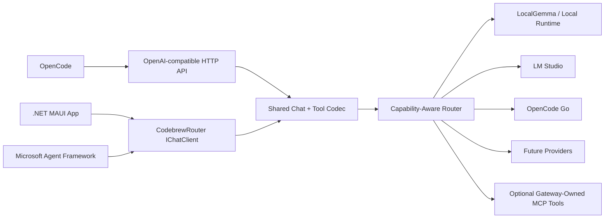

# CodebrewRouter OpenCode + Microsoft Agent Framework Compatibility Design

**Date:** 2026-05-13
**Status:** Design
**Scope:** OpenCode tool-compatible model gateway plus Microsoft Agent Framework / .NET MAUI `IChatClient` integration.

## Overview

CodebrewRouter should behave like a normal model for OpenCode while also serving as a first-class `IChatClient` for Microsoft Agent Framework agents in .NET MAUI apps. The shared requirement is not just text generation. Both consumers need model selection, streaming, tool calling, reasoning options, and capability metadata to behave predictably.

The design centers on a shared MEAI-first compatibility core:

- OpenCode talks to CodebrewRouter through the existing OpenAI-compatible `/v1/chat/completions` and `/v1/models` endpoints.
- Microsoft Agent Framework talks to CodebrewRouter through a registered `Microsoft.Extensions.AI.IChatClient`.
- Both paths share one message/tool codec, one model capability registry, and one routing decision layer.
- Client-owned tools are passed through to the model and returned as tool calls. They are not executed by the gateway.
- Gateway-owned tools, such as MCP-hosted tools, remain opt-in and are executed only by explicitly configured server-side middleware.

## Goals

1. Make CodebrewRouter usable from OpenCode as `codebrewrouter/codebrewRouter` with normal chat, streaming, tool calls, and model variants.
2. Make CodebrewRouter usable from Microsoft Agent Framework `ChatClientAgent` in a MAUI app via `IChatClient`.
3. Preserve OpenAI Chat Completions wire compatibility for tool-calling agent loops.
4. Route based on task type, model capability, context budget, tool requirements, and reasoning options.
5. Keep client-owned and gateway-owned tools separated for security and debuggability.
6. Add tests that exercise OpenCode-style tool loops and Microsoft Agent Framework-style `IChatClient` calls.

## Non-Goals

- Do not implement a full OpenAI Responses API surface in this phase.
- Do not make CodebrewRouter execute OpenCode's local tools server-side.
- Do not expose hidden chain-of-thought from models that do not natively expose provider-sanctioned reasoning summaries.
- Do not build a full A2A endpoint in this phase. The design leaves room for A2A later.
- Do not require Aspire for MAUI usage.

## Current State

The API already exposes an OpenAI-like chat completions endpoint and model catalog. The `codebrewRouter` virtual model already routes through `CodebrewRouterChatClient`, and OpenCode Go provider registrations exist in the core model enum and infrastructure.

The main compatibility gaps are:

- `ChatMessageDto.Content` is text-first and loses structured content semantics.
- Tool definitions are accepted but translated to placeholder `AIFunction`s that throw if invoked.
- The HTTP endpoint does not serialize assistant `tool_calls` or streaming `delta.tool_calls`.
- The endpoint does not model `role: "tool"` messages with `tool_call_id`.
- Unknown OpenCode / AI SDK option fields are not preserved as route hints.
- Provider selection is not capability-aware enough for "tools required", "JSON schema required", "vision required", or "reasoning requested".
- `CodebrewRouterProvider` is currently a registration shell, not a complete MAUI-ready agent client path.

## Architecture



The HTTP endpoint and MAUI `IChatClient` adapter should be thin translation layers. They convert external protocol types into a shared internal request model, call the same routing client, then translate responses back into the caller's expected protocol.

## Components

### 1. Shared Agent Chat Contract

Add a small internal contract that preserves all information needed by agent loops:

- request model id
- messages with roles: `system`, `user`, `assistant`, `tool`
- multipart content parts: text, image URL, data URI, unknown extension parts
- assistant tool calls: id, type, function name, raw JSON arguments
- tool results: tool call id, content
- tool definitions: type, function name, description, JSON schema parameters
- options: temperature, top-p, penalties, max output tokens, stop sequences, response format, tool choice, parallel tool calls
- extension options: reasoning effort, reasoning summary, thinking budget, text verbosity, OpenCode variant hints, custom headers if needed

This contract is internal to the gateway and prevents the HTTP DTOs from becoming the only source of truth.

### 2. OpenAI Chat Completions Codec

Replace the current text-only request/response mapping with a codec that supports the OpenAI Chat Completions agent-loop subset:

- Incoming messages:
  - `content` as string or content part array
  - assistant messages with `tool_calls`
  - tool messages with `tool_call_id`
- Incoming options:
  - `tools`
  - `tool_choice`
  - `parallel_tool_calls`
  - `response_format`
  - provider-specific extension fields retained as route hints
- Non-streaming responses:
  - assistant `content`
  - assistant `tool_calls`
  - `finish_reason` values including `stop`, `tool_calls`, `length`, `content_filter`
  - usage when available
- Streaming responses:
  - initial assistant role delta
  - text deltas
  - `delta.tool_calls` deltas
  - final chunk with correct finish reason
  - `data: [DONE]`

The codec should be covered by round-trip unit tests with raw JSON fixtures.

### 3. MEAI Tool Bridge

The bridge separates client-owned tool declarations from gateway-owned executable tools.

Client-owned tools:

- Come from OpenCode or MAUI Agent Framework.
- Are sent to the selected model as declarations.
- Are returned to the client as assistant tool calls.
- Are executed by the caller's agent loop.

Gateway-owned tools:

- Come from explicitly configured MCP or server-side tool registries.
- Are added by server-side middleware only when enabled.
- May be executed by `FunctionInvokingChatClient`.

The gateway must not convert OpenCode tools into throwing `AIFunction`s. That breaks agent loops and confuses ownership. If a selected provider adapter cannot pass tool declarations without executing them, the router should either choose a provider that can or return a clear `model_capability_error`.

### 4. Provider Capability Registry

Add capability metadata per provider/model:

```csharp
public sealed record ModelCapabilities(
    bool SupportsTools,
    bool SupportsStreamingToolCalls,
    bool SupportsParallelToolCalls,
    bool SupportsJsonSchema,
    bool SupportsVision,
    bool SupportsReasoningOptions,
    bool SupportsReasoningSummary,
    bool SupportsServerSideToolExecution,
    int MaxContextTokens,
    int ReservedOutputTokens,
    string Locality);
```

The registry can start as configuration-backed metadata seeded alongside model availability. Later it can merge runtime discovery.

Routing must use capability filters before task fallback ordering. Examples:

- A request with `tools` requires `SupportsTools`.
- A streaming OpenCode request with tools prefers `SupportsStreamingToolCalls`.
- A request with image parts requires `SupportsVision`.
- A request with `response_format.json_schema` requires `SupportsJsonSchema`.
- A request with `reasoningEffort` prefers `SupportsReasoningOptions` but may degrade if the selected profile allows fallback.

### 5. OpenCode Configuration

Add a checked-in sample such as `Docs/integrations/opencode/opencode.jsonc`:

```jsonc
{
  "$schema": "https://opencode.ai/config.json",
  "provider": {
    "codebrewrouter": {
      "npm": "@ai-sdk/openai-compatible",
      "name": "CodebrewRouter",
      "options": {
        "baseURL": "http://127.0.0.1:5022/v1",
        "apiKey": "notneeded"
      },
      "models": {
        "codebrewRouter": {
          "name": "CodebrewRouter",
          "limit": {
            "context": 128000,
            "output": 16384
          },
          "variants": {
            "fast": {
              "reasoningEffort": "low"
            },
            "thinking": {
              "reasoningEffort": "high",
              "reasoningSummary": "auto"
            },
            "local": {
              "providerHint": "local"
            }
          }
        }
      }
    }
  },
  "model": "codebrewrouter/codebrewRouter",
  "small_model": "codebrewrouter/codebrewRouter"
}
```

CodebrewRouter should tolerate OpenCode variant/provider option fields even when they are not part of the OpenAI spec.

### 6. Microsoft Agent Framework + MAUI Integration

Add a MAUI-oriented registration path that exposes CodebrewRouter as an `IChatClient`:

```csharp
builder.Services.AddKeyedChatClient("codebrewRouter", sp =>
{
    return sp.GetRequiredService<CodebrewRouterChatClient>()
        .AsBuilder()
        .UseLogging()
        .Build(sp);
});
```

The final implementation may use an adapter if `CodebrewRouterChatClient` cannot be registered directly in a mobile process. The important contract is that Microsoft Agent Framework can construct `ChatClientAgent` over the same `IChatClient` behavior used by the HTTP endpoint.

MAUI scenarios:

- **On-device/local:** use `CodebrewRouterProvider` with local model runtime and no remote discovery.
- **LAN gateway:** MAUI app uses an HTTP-backed `IChatClient` that points to a local network CodebrewRouter host.
- **Hybrid:** app starts local, then discovers a desktop/Aspire CodebrewRouter endpoint for larger models when available.

The MAUI path should not require appsettings or Aspire. It should be configured through `CodebrewRouterProviderOptions` and DI.

### 7. Reasoning, Thinking, and MoE Semantics

OpenCode model variants can pass reasoning-like options. CodebrewRouter should interpret them as routing hints:

- `reasoningEffort: low|minimal|none` prefers fast/local providers.
- `reasoningEffort: medium|high|xhigh` prefers reasoning-capable cloud or large local providers.
- `reasoningSummary: auto` is forwarded only to providers that support summaries.
- Anthropic-style `thinking` is preserved as an extension hint and only forwarded to compatible providers.

If the selected provider does not support true reasoning summaries, CodebrewRouter may still route to a strong reasoning model but must not fabricate hidden reasoning. It may return normal answer text and log that reasoning options were degraded.

MoE is a gateway behavior, not an OpenCode-visible model primitive. CodebrewRouter can expose a single model while routing internally across specialized backends.

### 8. Error Handling

Return OpenAI-style errors with stable codes:

- `invalid_request_error` for malformed tool calls or role sequences.
- `model_not_found` for unknown model ids.
- `model_capability_error` when no available provider supports required tools, JSON schema, vision, or context size.
- `context_length_exceeded` for prompts larger than all available budgets.
- `provider_error` for downstream failures.
- `model_unavailable` when all matching providers are disabled.

Streaming errors before the first chunk should return a normal JSON error response. Errors after streaming starts should be logged and terminate the stream cleanly with the best available final event behavior.

### 9. Observability

Keep router request telemetry under the existing `[ROUTER-*]` contract. Add tool and capability dimensions to router events only through approved contract changes.

Recommended events or fields:

- selected provider and model
- requested capabilities
- capability filter results
- tool count
- tool ownership: client-owned vs gateway-owned
- reasoning option handling: forwarded vs degraded
- route variant: default, fast, thinking, local

Any changes to tag names or event shape must update `Docs/engineering/logging-contract.md` and `Blaze.LlmGateway.Tests/RouterLoggingContractTests.cs`.

## Data Flow

### OpenCode Tool Loop

1. OpenCode sends `/v1/chat/completions` with `model`, `messages`, and `tools`.
2. HTTP codec converts the request to the shared agent chat contract.
3. Capability-aware router filters to providers that support tools.
4. Selected provider returns either text or assistant tool calls.
5. HTTP codec serializes tool calls back to OpenCode.
6. OpenCode executes the local tool.
7. OpenCode sends the tool result as `role: "tool"` with `tool_call_id`.
8. CodebrewRouter routes the follow-up turn and returns final text or more tool calls.

### MAUI Agent Framework Tool Loop

1. MAUI registers CodebrewRouter as an `IChatClient`.
2. `ChatClientAgent` sends messages and `ChatOptions.Tools`.
3. CodebrewRouter adapter converts MEAI messages/options to the shared agent chat contract.
4. Router selects a provider with required capabilities.
5. If the provider returns tool calls, the adapter maps them into MEAI response content.
6. Agent Framework executes tools according to its normal function invocation middleware.
7. Follow-up tool results re-enter the same `IChatClient`.

## Testing Strategy

Unit tests:

- Parse OpenAI chat requests with string content, part-array content, assistant tool calls, and tool result messages.
- Serialize non-streaming assistant tool calls.
- Serialize streaming `delta.tool_calls`.
- Preserve unknown OpenCode option fields as route hints.
- Capability filter rejects unsupported provider chains.
- Reasoning options are forwarded, degraded, or rejected according to profile settings.

Integration tests:

- OpenCode-style two-turn tool loop using a fake provider that emits a tool call.
- Streaming OpenCode-style tool call from fake provider.
- Microsoft Agent Framework-style `IChatClient` call with tools using a fake MEAI client.
- MAUI registration smoke test using `CodebrewRouterProviderOptions` with no Aspire dependencies.
- Regression test ensuring client-owned tools are not executed inside `ChatCompletionsEndpoint`.

Manual smoke tests:

- `curl` non-streaming tool-call request.
- `curl -N` streaming tool-call request.
- OpenCode configured with `codebrewrouter/codebrewRouter`.
- Small MAUI or console sample constructing `ChatClientAgent` over CodebrewRouter.

## Implementation Phases

### Phase 1: Wire Protocol Foundation

- Add shared internal chat/tool contract.
- Replace request parsing and response serialization in `/v1/chat/completions`.
- Add OpenAI-compatible fixtures and codec tests.
- Keep behavior compatible for existing simple chat requests.

### Phase 2: Tool Pass-Through

- Remove placeholder throwing tool translation.
- Add client-owned tool declaration pass-through.
- Add `role: "tool"` support.
- Add non-streaming and streaming tool-call serialization.
- Add fake-provider integration tests.

### Phase 3: Capability-Aware Routing

- Add model capability metadata.
- Filter fallback chains by required request capabilities.
- Surface capability errors.
- Add OpenCode model variants and route hints.

### Phase 4: MAUI + Microsoft Agent Framework

- Complete `CodebrewRouterProvider` registration so MAUI can resolve a real `IChatClient`.
- Add keyed chat client sample for `codebrewRouter`.
- Add Agent Framework sample with `ChatClientAgent`.
- Add mobile-safe defaults with no Aspire dependency.

### Phase 5: Docs and Operational Polish

- Add OpenCode config sample.
- Add MAUI / Agent Framework quickstart.
- Add diagnostics for supported capabilities per model.
- Update logging contract only if new router event shapes are introduced.

## Success Criteria

- OpenCode can use `codebrewrouter/codebrewRouter` as the main model.
- OpenCode can complete a normal edit session that requires tool calls.
- OpenCode streaming works for text and tool-call deltas.
- A MAUI app can register CodebrewRouter as an `IChatClient`.
- A Microsoft Agent Framework `ChatClientAgent` can use CodebrewRouter with tools.
- Client-owned tools are never executed by the gateway.
- Gateway-owned MCP tools remain opt-in and separately observable.
- Tests cover malformed tool loops, missing capabilities, and fallback behavior.

## Risks and Mitigations

| Risk | Mitigation |
| --- | --- |
| MEAI adapters may not expose raw tool-call details needed for OpenAI pass-through | Add a narrow provider adapter interface for tool-capable providers and use raw OpenAI-compatible clients where needed. |
| Local providers may claim OpenAI compatibility but mishandle tool calls | Capability registry starts conservative and requires tests before enabling tool support. |
| Thinking options could be misrepresented | Treat reasoning/thinking as route hints unless the provider explicitly supports summaries. |
| OpenCode option fields may change | Preserve unknown fields in extension metadata and keep config sample minimal. |
| MAUI platform constraints differ by OS | Keep provider registration DI-only, avoid Aspire/appsettings assumptions, and document local vs LAN modes. |

## References

- OpenCode provider docs: https://opencode.ai/docs/providers
- OpenCode config docs: https://opencode.ai/docs/config/
- OpenCode model / variant docs: https://opencode.ai/docs/models
- Microsoft Agent Framework `ChatClientAgent` docs: https://learn.microsoft.com/agent-framework/user-guide/agents/agent-types/chat-client-agent
- .NET MAUI Agent Framework integration docs: https://learn.microsoft.com/dotnet/maui/ai/agent-framework
- Existing provider design: `Docs/superpowers/specs/2026-05-04-codebrewrouter-provider-design.md`
- Existing Agent Framework design: `Docs/superpowers/specs/2026-05-03-codebrewrouter-model-sync-and-agent-framework.md`
- Logging contract: `Docs/engineering/logging-contract.md`
